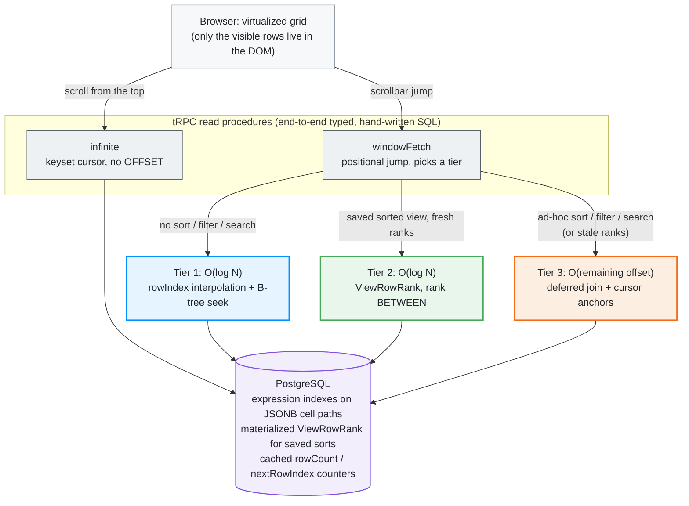

# Lyra Airtable

**A spreadsheet that stays sub-second at a million rows — scroll, jump, sort, filter, and search with no loading spinners.**


An Airtable-style grid with Google sign-in, bases and tables, dynamic TEXT and NUMBER columns, keyboard cell editing, and database-level search, filter, sort, and saved views. The whole engineering challenge is keeping every one of those interactions fast as a table grows from 25 rows to over a million — [The challenge](#the-challenge) covers why that's hard, and [How it works](#how-it-works) covers how each layer solves it.

> Built solo. The hard parts: floating-point row ordering, keyset pagination, materialized sort ranks (`ViewRowRank`), hand-written SQL on the hot read/write paths, and a two-source virtualized client.

## About this project

I built this to answer one systems question: can a browser-based spreadsheet stay genuinely interactive — sub-second scrolls, jumps, sorts, and searches — past a million rows, on commodity PostgreSQL with no specialized infrastructure? Almost every decision here serves that constraint: the tiered read strategy, the materialized rank table, the hand-written SQL on the hot paths, and the two-source virtualized client.

It originated as a technical assessment for [Lyra](https://www.lyratechnologies.ai/) ([certificate](https://www.lyratechnologies.ai/certificate/5TYDQNOY)), but the architecture, trade-offs, and the layers documented below are my own.

## Quick start

```bash
pnpm install                  # install dependencies
cp .env.example .env          # then set the variables below
./start-database.sh           # optional: local Postgres in Docker
pnpm prisma migrate dev       # run migrations (enables pgcrypto + pg_trgm, builds schema)
pnpm dev                      # start the dev server (Next.js + Turbopack)
```

Required environment variables, validated at startup by `src/env.js`:

| Variable | Purpose |
| --- | --- |
| `DATABASE_URL` | PostgreSQL connection string |
| `AUTH_SECRET` | NextAuth session secret (`npx auth secret`) |
| `AUTH_GOOGLE_ID` | Google OAuth client id |
| `AUTH_GOOGLE_SECRET` | Google OAuth client secret |

## The challenge

The obvious approaches all break down at 100K–1M+ rows:

- `OFFSET` pagination scans and discards every row before the window, so deep pages get slower the further you go.
- Integer row positions force a renumber of the whole table on an insert or a reorder.
- Sorting a million rows and jumping into the middle of the result has no cursor to start from.
- Loading rows into the browser grows memory without bound, and a tall enough scroll container hits the browser's height ceiling.

Every layer is built so cost scales with the visible window, not the table size or scroll depth.

## How it works

1. Rows live in one table, ordered by a floating-point `rowIndex`. Cells are a JSONB object keyed by column id, so adding a column inserts one row into `Column` instead of running a schema migration.
2. Reads use keyset cursors instead of `OFFSET`. A page is an index range scan with constant cost at any depth.
3. Jumps pick the cheapest of three paths: `rowIndex` estimation for unsorted tables, a materialized rank lookup for saved sorted views, or a deferred-join keyset query with cursor anchors for everything else.
4. Writes place a row at the midpoint between its neighbors, so an insert, duplicate, or reorder touches a single row.
5. Bulk inserts run as batched SQL with `generate_series`, loading 200K rows without a serverless timeout.
6. The client renders only the visible rows. It pulls contiguous pages near the top of the table and fills an on-demand jump cache for far-off windows.

## Architecture

A read request flows from a virtualized client, through a typed tRPC layer, into hand-written SQL that always lands on an index. The read path picks one of three strategies based on the view:



## Performance

Server-side query latency for the exact SQL each read procedure runs, measured with `EXPLAIN (ANALYZE, BUFFERS)` — pure Postgres execution time, so the numbers reflect the query strategy rather than network or render time. Reads are the median of 15 warm runs (2 discarded warmups, `ANALYZE` after seeding); writes are wall clock. Jumps target the middle of the table. Reproduce with `npx tsx latency-benchmark.ts`; full results with p95s land in `benchmark-results/`.

| Operation | 1K rows | 100K rows | 1M rows |
| --- | --- | --- | --- |
| Scroll one page (keyset) | 0.2 ms | 0.2 ms | 0.2 ms |
| Jump to middle, unsorted (Tier 1) | 0.2 ms | 0.2 ms | 0.2 ms |
| Jump to middle of a saved sorted view (Tier 2) | 0.9 ms | 1.0 ms | 1.1 ms |
| Jump to middle, ad-hoc sort (Tier 3 + cursor anchor) | 3.3 ms | 177 ms | 61 ms |
| Jump to middle of a filtered view (Tier 3) | 0.2 ms | 6.1 ms | 145 ms |
| Search, first page of matches | 0.8 ms | 14.5 ms | 15.7 ms |
| Duplicate one row (midpoint insert) | 1.7 ms | 2.4 ms | 3.7 ms |
| Duplicate a field (backfill every row) | 22 ms | 4.4 s | 82 s |
| Bulk insert 200K rows | 4.3 s | 5.7 s | 9.8 s |

The claim worth proving is not the absolute milliseconds but the **shape of the curve**: jump cost must not grow with depth. Sweeping jump depth across a 1M-row table:


<details>
<summary>Raw sweep numbers</summary>

| Jump depth → | 1K | 10K | 100K | 500K | 999K |
| --- | --- | --- | --- | --- | --- |
| Naive `OFFSET` (what the tiers replace) | 0.3 ms | 1.6 ms | 17 ms | 102 ms | 203 ms |
| Tier 1 — `rowIndex` seek | 0.2 ms | 0.2 ms | 0.2 ms | 0.2 ms | 0.2 ms |
| Tier 2 — `ViewRowRank` lookup | 1.0 ms | 1.1 ms | 1.1 ms | 2.0 ms | 1.1 ms |
| Tier 3 — ad-hoc sort, no anchor | 1.7 ms | 5.9 ms | 215 ms | 1.4 s | 1.6 s |

Full data: [`offset-sweep.csv`](benchmark-results/offset-sweep.csv). Chart regenerates via `npx tsx render-sweep-chart.ts`.

</details>

Tier 1 and Tier 2 are flat at any depth — that's the point of the architecture. Tier 3 (an ad-hoc sort the user just applied) is the honest worst case and grows with offset; the client's cursor anchors collapse it back down (1.2 s → 61 ms for a mid-table jump at 1M rows), and saving the sort promotes the view to Tier 2 permanently. One-time costs at 1M rows: sort-index build 4.9 s, view-rank computation 14.8 s — both deliberately deferred off the read path.

_Measured on Apple M2, 8 GB RAM, PostgreSQL 17.7 (local). Methodology and queries: [`latency-benchmark.ts`](latency-benchmark.ts) — it mirrors the procedures' SQL verbatim, seeds each size with the same `generate_series` bulk loader the app uses, and cleans up after itself._

## Tech stack

| Layer | Technology | Purpose |
| --- | --- | --- |
| Framework | Next.js 15 (App Router, Turbopack), React 19 | UI and routing |
| API | tRPC 11 + superjson | End-to-end typed client/server calls |
| Database | PostgreSQL + Prisma 6 | Storage; raw SQL on the hot paths |
| Auth | NextAuth 5 (Google OAuth) | Database-backed sessions |
| State | Zustand + TanStack Query | View/UI state and server cache |
| Virtualization | @tanstack/react-virtual, @tanstack/react-table | Row windowing and the column model |
| Styling | Tailwind CSS 4 + CSS Modules | Component styling |
| Validation | Zod | Shared client/server schemas |
| Testing | Vitest + Playwright | SQL unit tests and E2E |

## Project structure

```
prisma/
  schema.prisma         Base, Table, Column, View, ViewRowRank, Row (+ NextAuth tables)
  migrations/           schema history, pg extensions, search-index changes
src/
  app/                  Next.js App Router (dashboard, bases, tables, auth, api routes)
  components/
    grid/               the grid engine: GridStore, hooks/, ui/, utils/
    bases/ home/ auth/  dashboard, base cards, auth screens
  server/
    api/routers/        tRPC routers (base, table, column, row, view)
      row/              infinite, windowFetch, search, sort, mutations
    sql/                filter / sort / query SQL builders (unit-tested)
    db/ seed/ auth/     on-demand indexing, table seeding, NextAuth config
  shared/               Zod schemas, view config, config fingerprinting
  hooks/                cross-cutting React hooks
stress-test.ts          concurrency and data-integrity harness (npx tsx)
batch-benchmark.ts      bulk-insert batch-size sweep (npx tsx)
latency-benchmark.ts    server-side latency benchmark — source of the Performance tables (npx tsx)
render-sweep-chart.ts   renders benchmark-results/offset-sweep.csv into the latency chart SVG
```

## Scripts

```bash
pnpm dev          # dev server (Next.js + Turbopack)
pnpm build        # prisma migrate deploy + generate + next build
pnpm check        # next lint + tsc --noEmit

pnpm test         # Vitest unit tests (SQL builders)
pnpm test:e2e     # Playwright E2E
pnpm db:studio    # Prisma Studio

npx tsx latency-benchmark.ts   # regenerate the Performance tables (seeds 1K/100K/1M, ~4 min)
npx tsx stress-test.ts         # concurrency + data-integrity suite (needs pnpm dev running)
```

## Docs

Read in order as each layer's decisions feed the next.

| Document | What's in it |
| --- | --- |
| [Data model](docs/data-model.md) | Float row ordering, JSONB cells, cached counters, `ViewRowRank`, index layout |
| [Query engine](docs/query-engine.md) | How filter / sort / search SQL is built to use the indexes, safely |
| [Reading at scale](docs/reading-at-scale.md) | The three-tier read strategy, cursor anchors, the `UNION ALL` rewrite, jump-to-match |
| [Writing at scale](docs/writing-at-scale.md) | Midpoint inserts, bulk loads, the sort rewrite, rank computation, field duplication |
| [The client grid](docs/client-grid.md) | Two-source virtualization, the scroll-height ceiling, optimistic updates, state |
