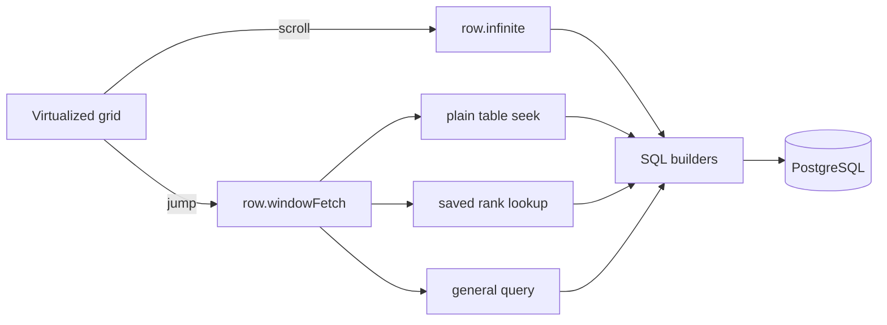

# Architecture

The application has one awkward requirement: the scrollbar must be able to land anywhere in a table without loading the rows before it.

That rules out a few common shortcuts. `OFFSET 800000` still makes Postgres walk 800,000 entries. Sending the table to the browser moves the same problem into memory. Integer positions make an insert near the top rewrite everything below it.

The design separates those concerns:

- the browser renders a small virtual window;
- tRPC carries the current view to the server;
- PostgreSQL returns only that window;
- writes maintain enough ordering metadata for later reads.

## Request flow

There are two row-reading procedures:

- `row.infinite` continues from a known row using a keyset cursor. It is used for ordinary forward scrolling.
- `row.windowFetch` starts at an absolute position. It is used after a scrollbar jump and chooses one of three query paths.

## The three jump paths

| Path | Used when | Method |
| --- | --- | --- |
| Plain table | No sort, filter, or search | Estimate the target `rowIndex`, then seek into `(tableId, rowIndex)` |
| Saved rank | A sorted view has fresh `ViewRowRank` entries | Read a range from `(viewId, rank)` |
| General query | Filters, search, an ad-hoc sort, or stale ranks | Sort ids first, join full rows later, and use a nearby cursor anchor when available |

The first two paths have index lookup cost at any depth. The general path is the honest fallback: it can still depend on the remaining offset. The client reduces that distance by sending cursors from windows it has already seen. Measured results, including the slow path, are in [performance.md](performance.md).

## Storage choices

Rows use a floating-point `rowIndex`. Inserting between `2` and `3` produces `2.5`, so nearby rows do not move. Cell values live in a JSONB object keyed by column id, which lets users add fields without changing the database schema. Frequently needed totals such as `rowCount` are stored on the table.

Saved sorted views have an additional `ViewRowRank` table. It turns “row 800,000 in this sort” into a range lookup. Ranks are derived data: if they are stale or missing, reads use the general path instead.

[Data model →](data-model.md) · [Read path →](reading-at-scale.md) · [Write path →](writing-at-scale.md)

## Client and server responsibilities

The browser owns interaction state: selection, editing, virtualization, and a bounded cache of fetched windows. TanStack Query owns server data; Zustand owns synchronous grid state.

The server owns validation, authorization, query selection, and every database write. Prisma handles the schema and ordinary queries. The row hot paths use parameterized SQL builders because they need keyset predicates and JSON expression indexes that are cumbersome to express through Prisma.

Every tRPC procedure requires a session and checks ownership through the requested base or table. Rate limiting sits after authentication. See [API reference](api.md) and [configuration](configuration.md).

## Failure behavior

- Missing or stale ranks use the general query path.
- Missing Upstash credentials use a process-local rate limiter.
- A rate-limit store error fails open.
- A failed rank build leaves the view marked stale, so partial ranks are not read.

These fallbacks preserve correctness. They do not all preserve the same performance, which is why the docs keep the fast paths and the general path separate.
