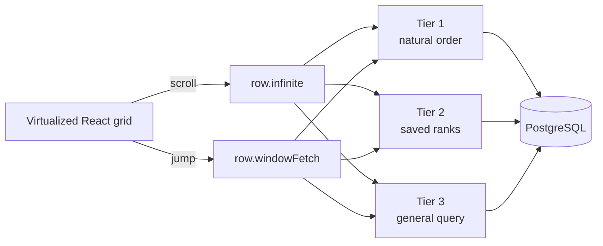

# Architecture

A scrollbar jump must land anywhere in a million-row table without loading the rows above it. That requirement drives the design.

Three common shortcuts fail:

- `OFFSET 800000` still makes PostgreSQL walk 800,000 entries.
- Sending the full table to the browser moves the problem into memory.
- Integer positions make an insert near the top rewrite every row below it.

## System flow



Each layer has one job:

| Layer       | Responsibility                                                            |
| ----------- | ------------------------------------------------------------------------- |
| Browser     | Render a virtual window. Manage interaction and cache bounded row windows |
| tRPC server | Authenticate and validate the active view. Choose a read tier             |
| PostgreSQL  | Store rows and return one ordered window                                  |
| Write path  | Maintain the counters, positions, indexes, and ranks needed by reads      |

`row.infinite` continues from a cursor during normal scrolling. `row.windowFetch` starts from an absolute position after a distant scrollbar jump.

## Three read tiers

| Tier                      | Used when                                    | Method                                                     |
| ------------------------- | -------------------------------------------- | ---------------------------------------------------------- |
| **Tier 1: natural order** | No sort or filter                            | Continue or seek through indexed `rowIndex`                |
| **Tier 2: saved ranks**   | Sort-only view with fresh `ViewRowRank` data | Read a `(viewId, rank)` range                              |
| **Tier 3: general query** | Filters, live sorts, or unavailable ranks    | Keyset scrolling with a deferred join for positional jumps |

Tier 1 and Tier 2 can start near the target regardless of depth. Tier 3 remains the correct fallback but can become slower for deep jumps. Stale or failed rank builds safely fall back to Tier 3. Partial ranks are never read.

The current search box is find-in-view rather than a server-side row filter. The row APIs support search, but the grid uses dedicated match-count and edge-navigation procedures.

## Storage choices

| Concern             | Stored as                 | Why                                                 |
| ------------------- | ------------------------- | --------------------------------------------------- |
| Natural order       | Floating-point `rowIndex` | Midpoint inserts update one row                     |
| Cell values         | JSONB keyed by column id  | Adding a field does not alter the PostgreSQL schema |
| Table size          | Materialized `rowCount`   | The grid avoids routine `COUNT(*)`                  |
| Saved sort position | `ViewRowRank`             | Deep sorted jumps become indexed range reads        |

The full schema is described in [Data model](data-model.md).

## Technology choices

| Layer          | Technology                                                       |
| -------------- | ---------------------------------------------------------------- |
| Application    | Next.js 15, React 19, TypeScript                                 |
| Grid           | TanStack Virtual and TanStack Table                              |
| Client state   | TanStack Query for server data and Zustand for interaction state |
| API            | tRPC 11, Zod, superjson                                          |
| Data access    | Prisma 6 plus parameterized SQL builders                         |
| Storage        | PostgreSQL                                                       |
| Authentication | NextAuth with Google OAuth                                       |
| Rate limiting  | Upstash Redis with a process-local fallback                      |
| Tests          | Vitest and Playwright                                            |

Prisma handles the schema and ordinary queries. SQL builders handle JSON expressions and multi-field cursors. They also support deferred joins.

## Repository map

```text
prisma/                  schema and migrations
src/app/                 Next.js routes
src/components/grid/     grid UI, virtualization, client state
src/server/api/          tRPC middleware and routers
src/server/sql/          sort, filter, and cursor builders
benchmark-results/       committed measurements
scripts/benchmarks/      latency, batch-size, and offset-sweep-chart scripts
scripts/stress/          concurrency stress-test suite
e2e/                     Playwright tests
```

Continue to [Scaling engine](scaling-engine.md) for the read/write algorithms and measurements, or [Data model](data-model.md) for the schema.
