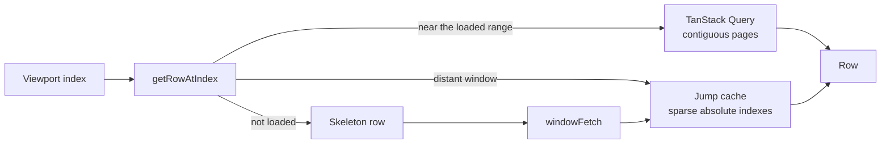

# The client grid

The grid lives in [`src/components/grid/`](../src/components/grid/). It has to keep DOM size and browser memory bounded while still exposing a scrollbar for the full table.



## Virtual rows

`@tanstack/react-virtual` renders the viewport plus overscan. The browser never receives a DOM node for every database row.

There is a second limit: browsers become unreliable when a scroll container is tens of millions of pixels tall. The grid caps its virtual height at 15,000,000 pixels. If `rowCount × rowHeight` exceeds that, virtual positions are mapped proportionally to real row positions:

```text
actual = round(virtual × (total - 1) / (virtualTotal - 1))
```

Below the cap, virtual and actual indexes are the same.

## Two row sources

The renderer reads rows through one `getRowAtIndex` function, backed by:

- TanStack Query pages for contiguous scrolling;
- a sparse `Map<absoluteIndex, Row>` for windows fetched after a distant jump.

Loading every intermediate page to reach row 700,000 would defeat virtualization. A jump therefore calls `row.windowFetch` for the visible range and places the result directly at its absolute indexes. Until it arrives, those indexes render skeleton rows.

## Jump cache rules

[`useJumpCache.ts`](../src/components/grid/hooks/useJumpCache.ts) handles requests that can finish out of order.

- Fetches are throttled and biased in the current scroll direction.
- A generation number changes when the sort, filters, search, or view changes. Responses from an older generation are ignored.
- The sparse cache is bounded; it is cleared when it grows past its limit.
- Optimistically inserted rows are temporarily protected from an older window response.

The cache also records cursors at known offsets. Those anchors are sent with later jump requests so the server can seek near the target before applying any remaining offset.

## State ownership

TanStack Query owns data returned by the server and its invalidation. Zustand, through [`GridStore.tsx`](../src/components/grid/GridStore.tsx), owns interaction state such as selection, editing, view configuration, and column sizes.

Cell edits and inserts update the UI first. The matching tRPC mutation then confirms the change or rolls it back. This separation keeps keyboard and pointer feedback synchronous without treating the local store as the database.

## API transport

[`src/trpc/react.tsx`](../src/trpc/react.tsx) configures tRPC with `httpBatchStreamLink` and superjson. Calls made together can share an HTTP request, while completed results stream back independently. A shared mutation error handler turns server failures into toasts.

The server-side read strategies behind the cache are described in [reading-at-scale.md](reading-at-scale.md).
