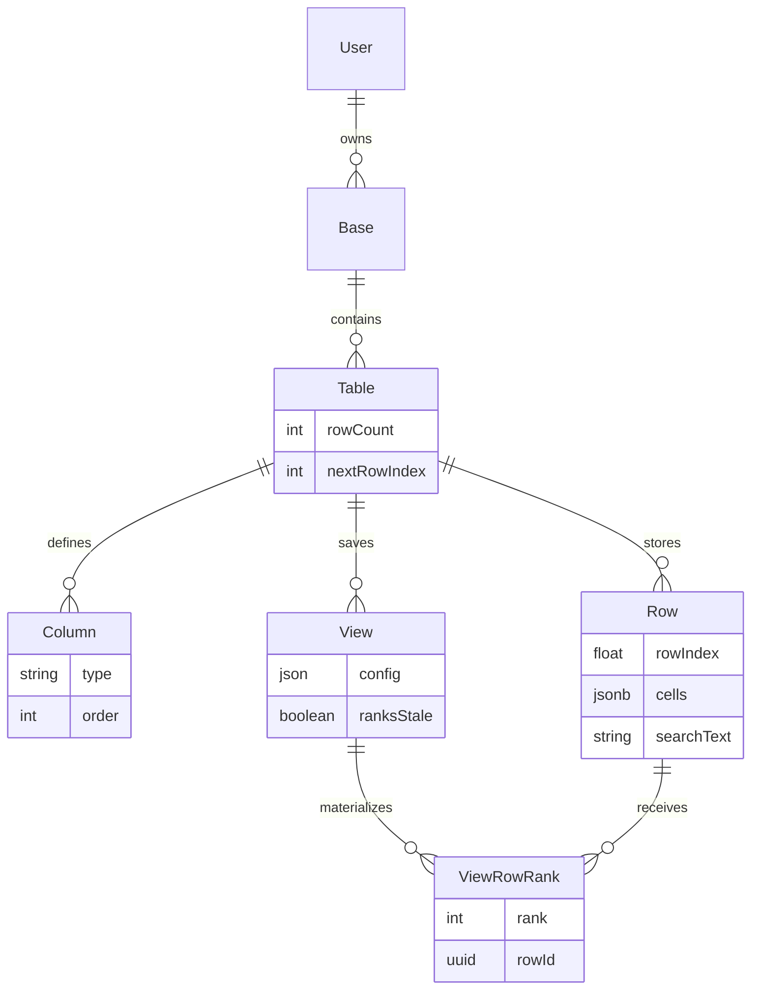

# Data model

The schema is in [`prisma/schema.prisma`](../prisma/schema.prisma).



NextAuth adds its usual account and session tables alongside these.

## Rows and cells

Each `Row` has a `tableId`, a floating-point `rowIndex`, a JSONB `cells` object, and a denormalized `searchText` value.

```jsonc
{
  "column-id-a": "Acme Corp",
  "column-id-b": 42
}
```

The JSON keys are `Column.id` values. This means adding a spreadsheet field creates a `Column` record; it does not alter the PostgreSQL table. `Column.type` is currently either `TEXT` or `NUMBER`, and the query builders use that type when validating and sorting values.

The trade-off is indexing. A sort on a field reads an expression such as:

```sql
NULLIF(cells->>'column-id-a', '')
```

The app creates a matching expression index when a field is first sorted. Filters use the same expression and can use that index when it already exists. The app does not maintain one for every field up front.

## Row order

`rowIndex` is a float and is unique within a table. Appended rows normally use `1, 2, 3...`; an insert between `2` and `3` can use `2.5`.

That keeps inserts and drag reorders local. They update the moved row rather than renumbering the rows below it.

The current implementation does not rebalance exhausted float gaps. Repeatedly inserting into the same gap can eventually produce a duplicate `rowIndex` and fail the unique constraint. A production version would need a local re-spacing path for that edge case.

`Table.nextRowIndex` is an integer high-water mark for appends. `Table.rowCount` is the stored row total. Both avoid a `MAX` or `COUNT` scan on routine requests and are updated with the write that changes the table.

## Search text

`searchText` contains the row's searchable cell values in one lowercased string. Cell writes rebuild it so search does not have to extract every JSON value at query time.

`pg_trgm` is installed by the migrations, but the former trigram index on `searchText` was removed because of its write cost. Search currently has no dedicated text index. See [query-engine.md](query-engine.md) for that history and the measured trade-off.

## Saved ranks

`View.config` stores the view's sort, filters, search, field order, and hidden fields. A sort-only view can also have one `ViewRowRank` entry per row:

```prisma
model ViewRowRank {
  viewId String
  rowId  String @db.Uuid
  rank   Int

  @@id([viewId, rank])
  @@unique([viewId, rowId])
}
```

Ranks are one-based in the current write path. A jump into a fresh ranked view reads a range from the `(viewId, rank)` primary key instead of sorting up to the requested position.

Ranks are disposable derived data. `View.ranksStale` tells readers whether they can be used. If not, the read falls back to the general query and a later write rebuilds them.

## Main indexes

| Index | Used for |
| --- | --- |
| `(tableId, rowIndex)` | Natural order, keyset scrolling, and plain-table jumps |
| Per-field JSON expression indexes | Sorts and filters on user-created fields |
| `(viewId, rank)` | Jumps through a saved sorted view |

The write behavior behind these fields is covered in [writing-at-scale.md](writing-at-scale.md).
