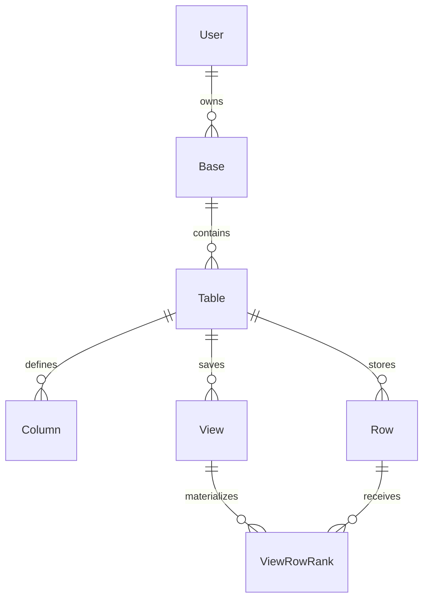

# Data model

The Prisma schema has two layers:

1. Product records for the workspace and grid.
2. Derived metadata that makes large reads cheaper.

The source of truth is [`prisma/schema.prisma`](../prisma/schema.prisma).

## Schema



| Model         | Important fields                                   | Why it is shaped this way                                                                |
| ------------- | -------------------------------------------------- | ---------------------------------------------------------------------------------------- |
| `Base`        | `ownerId`, `isStarred`, `lastOpenedAt`             | Ownership plus recent/starred dashboard ordering                                         |
| `Table`       | `nextRowIndex`, `rowCount`, `nextColumnOrder`      | Atomic append/column positions and a cached count                                        |
| `Column`      | `type`, `order`, `config`, `sourceColumnId`        | Field metadata. Source id marks an in-progress duplication                               |
| `View`        | `config`, `ranksStale`                             | Saves filters, sorts, and layout. Gates ranked reads                                     |
| `ViewRowRank` | `(viewId, rank)`, `(viewId, rowId)`                | Direct lookup by sorted position and row membership                                      |
| `Row`         | UUID `id`, `rowIndex`, JSONB `cells`, `searchText` | Database-generated ids keep bulk insert cheap. The rest support order, cells, and search |
| Auth tables   | `Account`, `Session`, `VerificationToken`          | Standard NextAuth Prisma-adapter records                                                 |

## Rows and cells

Each spreadsheet row is one PostgreSQL record. Columns are metadata. Cell values live in a JSONB object keyed by `Column.id`:

```json
{
  "column-id-a": "Acme Corp",
  "column-id-b": 42
}
```

Adding a field creates a `Column` record instead of altering a large PostgreSQL table. Types are currently `TEXT` and `NUMBER`.

Sorts and filters extract JSON values with expressions such as:

```sql
NULLIF("Row"."cells"->>'column-id-a', '')
```

The first sort on a field creates a matching expression index. This avoids maintaining an index for every spreadsheet field.

## Natural row order

Appends claim increasing integer positions. An insert between two rows uses their midpoint:

```text
before: 2.0, 3.0
insert: 2.5
```

Only the inserted row changes. `Table.nextRowIndex` lets concurrent appenders reserve distinct positions, while `Table.rowCount` sizes the scrollbar without routine `COUNT(*)`.

> Floating-point gaps are finite. The current implementation does not rebalance an exhausted gap, so enough repeated inserts at one position can collide with the unique `(tableId, rowIndex)` constraint.

## Views and saved ranks

`View.config` stores filters, sorts, hidden columns, and layout. A committed sort can materialize one `ViewRowRank` per row.

The `(viewId, rank)` primary key turns "show rows around sorted position 700,000" into an indexed range lookup. Ranks are disposable: stale or missing data falls back to Tier 3, and rows added after a build form an unranked tail.

## Search text

`Row.searchText` is a denormalized concatenation of the row's cell values. Cell edits rebuild it in the same write, and PostgreSQL performs case-insensitive matching with `ILIKE`.

The former trigram index was removed because its write cost hurt bulk inserts and edits. Search is therefore a known scan-heavy path.

See [Architecture](architecture.md) for the system view and [Scaling engine](scaling-engine.md) for how these fields are read and maintained.
