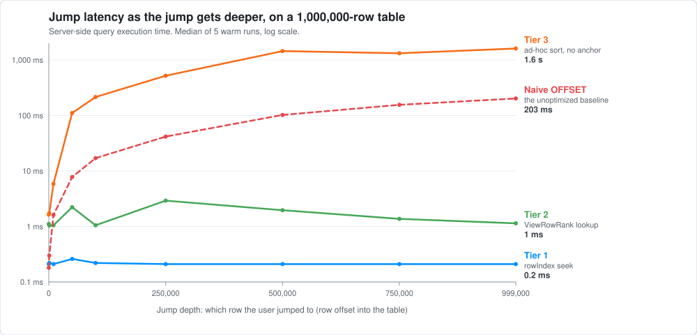

# Performance

Performance is measured at two layers: the complete browser interaction and the PostgreSQL query underneath it.

## System latency

The system benchmark runs Chromium against a production build with one million rows. It drags the real scrollbar to 10%, 25%, 50%, 75%, and 90% of the table, repeating the sweep three times.

| Measurement                              | Samples | Median |    p95 |
| ---------------------------------------- | ------: | -----: | -----: |
| Page navigation → first real row         |      15 | 136 ms | 225 ms |
| Scrollbar drag → `windowFetch` response  |      15 |  95 ms | 130 ms |
| Scrollbar drag → real target row visible |      15 | 403 ms | 578 ms |

The middle measurement includes the client throttle, HTTP request, auth, database query, and serialization. The last also includes cache reconciliation and React rendering until a non-skeleton row near the target is visible.

Raw samples are in [`system-latency.json`](../benchmark-results/system-latency.json). The run used local Chromium and `next start`; the configured database connection remained part of the request path.

To reproduce it, start a production build on port 3000, then run:

```bash
pnpm benchmark:system
```

The harness creates its own authenticated E2E session, temporarily grows the dedicated E2E table to one million rows if needed, then restores its original row count.

## Database latency

The database benchmark runs the SQL used by the row procedures with `EXPLAIN (ANALYZE, BUFFERS)`. Reads are the median of 15 warm runs after two warmups. Writes are wall-clock time. The recorded machine was an Apple M2 with 8 GB RAM running PostgreSQL 17.7.

```bash
npx tsx latency-benchmark.ts
```

Full output, including p95 values, is in [`latency-results.md`](../benchmark-results/latency-results.md).

## Read results

| Operation                      | 1K rows | 100K rows | 1M rows |
| ------------------------------ | ------: | --------: | ------: |
| Keyset page                    |  0.2 ms |    0.2 ms |  0.2 ms |
| Plain-table middle jump        |  0.2 ms |    0.2 ms |  0.2 ms |
| Saved-rank middle jump         |  0.9 ms |    1.0 ms |  1.1 ms |
| Ad-hoc sort, no anchor         |  4.6 ms |    113 ms |  1.22 s |
| Ad-hoc sort, with anchor       |  3.3 ms |    177 ms | 60.6 ms |
| Filtered middle jump           |  0.2 ms |    6.1 ms |  145 ms |
| First search page              |  0.8 ms |   14.5 ms | 15.7 ms |
| Naive middle `OFFSET` baseline |  0.2 ms |    7.1 ms |  102 ms |

The plain seek and saved-rank lookup stay flat as the table grows. The general path does not: an unanchored ad-hoc sort reaches 1.22 seconds at one million rows. A nearby client cursor reduced that measured case to 60.6 ms, but the 100K result also shows that an anchor is not automatically faster; its usefulness depends on where it lands and the query plan PostgreSQL chooses.

Filtered jumps had a 1.32-second p95 at one million rows despite a 145 ms median. That variance matters for the user experience and is why the general path is documented as a fallback rather than described as constant time.

## Write results

| Operation                      | 1K-row table | 100K-row table | 1M-row table |
| ------------------------------ | -----------: | -------------: | -----------: |
| Duplicate one row              |       1.7 ms |         2.4 ms |       3.7 ms |
| Duplicate a field and backfill |      21.8 ms |          4.4 s |       82.0 s |
| Benchmark 200K-row bulk insert |        4.3 s |          5.7 s |        9.8 s |

The single-row insert is local, so table size has little effect. Field duplication touches every row and scales accordingly. The application exposes its backfill in batches; the 200K bulk figure is a benchmark workload, not the public `row.addMany` limit, which is 100,000 rows per call.

At one million rows, building the tested sort index took 4.9 seconds and computing saved ranks took 14.8 seconds. Those are one-time write costs for the fast saved-view read path.

## Depth sweep



The sweep makes the distinction clearer. Plain seeks and saved ranks remain close to flat. Naive `OFFSET` and an unanchored ad-hoc sort rise with depth. Raw values are in [`offset-sweep.csv`](../benchmark-results/offset-sweep.csv); regenerate the chart with:

```bash
npx tsx render-sweep-chart.ts
```

Two related harnesses live at the repository root:

- `batch-benchmark.ts` compares bulk-insert chunk sizes.
- `stress-test.ts` checks counters and row/rank integrity under concurrent writes.
