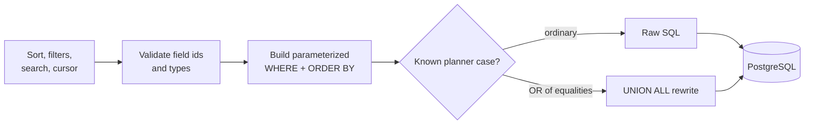

# Query engine

Prisma handles the schema, migrations, and ordinary application queries. Row windows use hand-written SQL from [`src/server/sql/`](../src/server/sql/) because they need JSON expression indexes, multi-field keyset cursors, and a few planner-specific rewrites.

The SQL is executed through Prisma's raw-query API. Unit tests for the builders live in [`src/server/sql/__tests__/`](../src/server/sql/__tests__/).



## Safety rules

Dynamic SQL has two kinds of input:

1. Values such as search terms and filter values are always bind parameters (`$1`, `$2`, ...).
2. A column id must appear inside a JSON path and cannot be bound there. Before interpolation, the router checks that the id belongs to the requested table; [`escape.ts`](../src/server/sql/escape.ts) then escapes it as a SQL literal.

`LIKE` input also escapes `%`, `_`, and `\`, so those characters are searched literally rather than becoming patterns.

## Sorts

A text sort uses the value extracted from `Row.cells`:

```sql
NULLIF("Row"."cells"->>'column-id', '')
```

Number fields cast the same expression to `double precision`. Empty strings become `NULL`; ascending order places them first and descending order places them last.

`rowIndex` is always the final sort key. Without a unique tie-breaker, two rows with the same cell value could be skipped or repeated when a page boundary moves.

For a sort on fields `A` and `B`, a forward cursor expands to the usual lexicographic predicate:

```sql
A > $a
OR (A = $a AND B > $b)
OR (A = $a AND B = $b AND rowIndex > $rowIndex)
```

The builder handles ascending and descending order, `NULL` placement, and the reverse form used by previous-match search.

## Filters

Filters use the same JSON expressions as sorts, allowing them to use the per-field indexes. Supported operations include equality, contains, empty checks, and numeric comparisons. Flat lists and nested AND/OR groups both compile through the same parameter array.

An OR of equality checks on one field gets special treatment. PostgreSQL often chooses a bitmap plan that loses row order and then sorts the full result. The engine can rewrite that shape into ordered `UNION ALL` branches and merge them. Other filter shapes stay on the general builder.

## Deferred joins

For a deep sorted window, the inner query selects only row ids:

```sql
SELECT r.*
FROM (
  SELECT "Row"."id"
  FROM "Row"
  WHERE ...
  ORDER BY ...
  LIMIT $limit OFFSET $offset
) picked
JOIN "Row" r ON r."id" = picked."id"
ORDER BY ...
```

This keeps the sort input small and delays reading the full JSONB value until the final window. Per-field indexes include the row id where useful, allowing the inner part to use an index-only scan.

## Index lifecycle

[`ensureColumnIndexes.ts`](../src/server/db/ensureColumnIndexes.ts) creates a field's sort index on first use. The expression matches the query builder exactly, including the numeric cast and empty-value handling. Column, table, and base deletion clean up the corresponding dynamic indexes.

Search is different. `searchText` once had a trigram GIN index, but maintaining it made bulk inserts and edits more expensive. The migration history removes that index while leaving `pg_trgm` installed. The current search predicate therefore has a real scaling limit; its timings are reported in [performance.md](performance.md), rather than hidden behind the general sort numbers.
