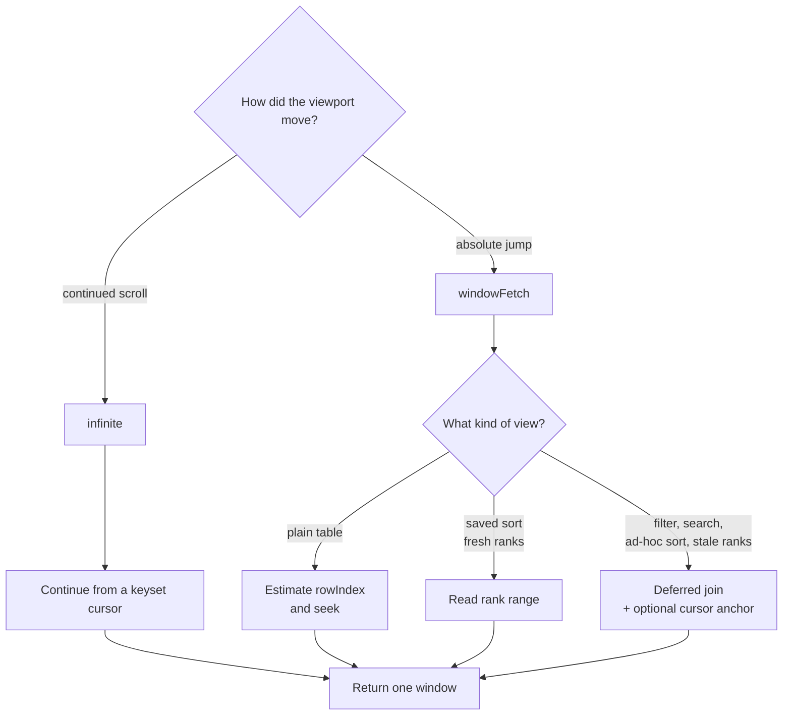

# Reading at scale

Two tRPC procedures return rows:

- [`infinite`](../src/server/api/routers/row/infiniteProcedure.ts) continues from a cursor;
- [`windowFetch`](../src/server/api/routers/row/windowFetchProcedure.ts) fetches an absolute window after a scrollbar jump.

Both accept the current sort, filters, and search term. Both return rows, a cursor, and a total.

## Read path at a glance



## Ordinary scrolling

For an unsorted table, `infinite` asks for rows after the last `rowIndex`:

```sql
WHERE "tableId" = $1 AND "rowIndex" > $cursor
ORDER BY "rowIndex"
LIMIT $limit
```

Sorted pages carry the sort values and `rowIndex` in the cursor. The SQL builder expands those values into a lexicographic “after this row” predicate. Equal sort values use `rowIndex` as the final tie-breaker, which prevents gaps and duplicates between pages.

Fresh saved ranks have their own cursor. Ranked rows are read first; rows added since the last rank build follow as an unranked tail.

## Jumping to a position

An absolute jump has no previous row to continue from. `windowFetch` chooses a path from the shape of the view.

### Plain table

With no sort, filter, or search, the server estimates a `rowIndex` from the table's minimum, maximum, and stored row count:

```text
min + offset × (max - min) / (rowCount - 1)
```

It then performs a B-tree seek from that value. This is very fast and is accurate for the append-heavy, near-sequential tables produced by the bulk loader.

It is an estimate, not an exact rank calculation. A table with many uneven midpoint inserts or reorders can land near, rather than exactly on, the requested ordinal row. Exact rank at arbitrary depth would require either maintained ranks or work proportional to the skipped set.

### Saved sorted view

A sort-only view with fresh `ViewRowRank` data can fetch:

```sql
WHERE "viewId" = $1 AND "rank" BETWEEN $start AND $end
```

The primary key starts with `(viewId, rank)`, so depth does not change the lookup. A missing target rank or a stale view sends the request to the general path.

### General query

Filters, search, ad-hoc sorts, and stale ranks use `LIMIT`/`OFFSET`. Two changes reduce the cost:

1. The inner query selects and sorts row ids. Full JSONB rows are joined only after the window has been chosen.
2. If the client knows a cursor near the target, the server seeks to that cursor and applies `OFFSET` only to the remaining distance.

For example, a jump to 500,000 with an anchor at 480,000 skips 20,000 rows, not 500,000. This path can still get slower as that remaining distance grows; it is the main limitation of the current design.

## Filters and counts

The SQL builders support flat filters and nested AND/OR groups. One common case—OR conditions comparing the same field for equality—is rewritten as `UNION ALL` branches. That lets Postgres merge ordered index scans instead of building a bitmap and sorting the full match set.

Filtered totals need `COUNT(*)`. The first request computes the count alongside the data query. Later window fetches can send `skipCount` and the last known total, avoiding the same count on every jump.

## Search navigation

[`searchProcedures.ts`](../src/server/api/routers/row/searchProcedures.ts) provides the total match count and first/last edge lookups. Next and previous navigation uses the active sort in either direction and returns the row plus its position for the grid to reveal.

The measured behavior of all three jump paths is in [performance.md](performance.md). SQL construction is covered in [query-engine.md](query-engine.md).
