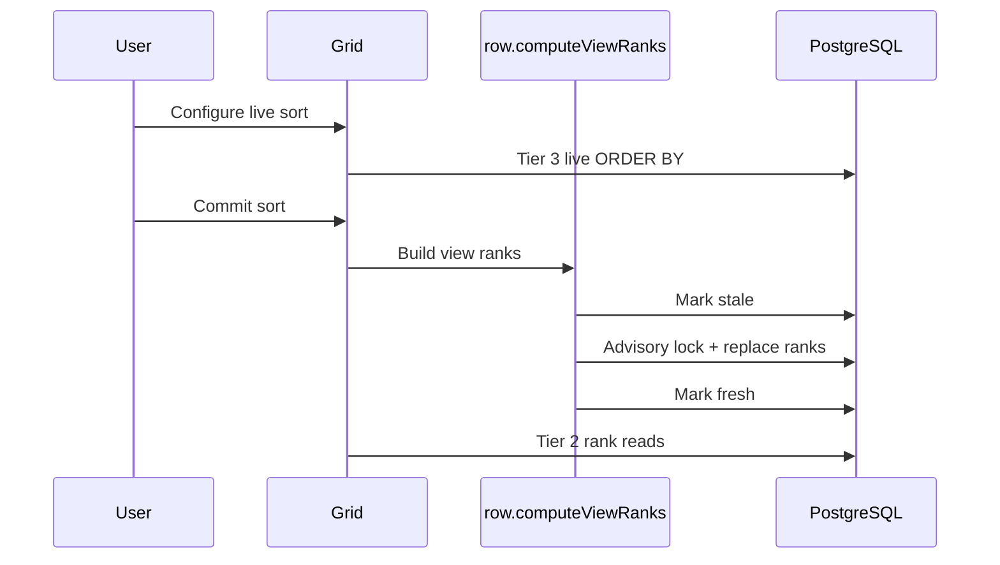

# Scaling engine

The central problem is positional access: show rows around position 700,000 without loading or discarding the 699,999 rows before it. The engine combines bounded client caches with three PostgreSQL read tiers.

## Scrolling versus jumping

| Procedure         | Used for                          | Starts from                     |
| ----------------- | --------------------------------- | ------------------------------- |
| `row.infinite`    | Initial load and normal scrolling | A cursor from the previous page |
| `row.windowFetch` | Distant scrollbar jumps           | An absolute target offset       |

Scrolling already knows the previous row, so every tier uses keyset pagination. A jump must recover an absolute position and selects the cheapest valid tier.

## Tier 1: natural order

A plain table scrolls after the last `rowIndex`:

```sql
WHERE "tableId" = $1
  AND "rowIndex" > $cursor
ORDER BY "rowIndex"
LIMIT $limit
```

For a jump, the server estimates the target position:

```text
estimated = min + offset × (max - min) / (rowCount - 1)
```

It then seeks through the `(tableId, rowIndex)` B-tree. Dense append-heavy
tables take the direct seek. For uneven midpoint inserts, the server validates
the estimate's rank, corrects the remaining distance, and falls back to an
exact offset query if the correction cannot produce a complete window.

## Tier 2: saved ranks

A committed sort stores one `ViewRowRank` per row:

```sql
WHERE "viewId" = $1
  AND "rank" BETWEEN $start AND $end
ORDER BY "rank"
```

The `(viewId, rank)` primary key makes lookup cost independent of table depth. Rows inserted after the last build form an unranked tail. Stale ranks or a jump into that tail fall back to Tier 3.

## Tier 3: general query

Filters, live sorts, and unavailable ranks choose ids before loading full JSONB rows:

```sql
SELECT r.*
FROM (
  SELECT "Row"."id"
  FROM "Row"
  WHERE ...
  ORDER BY ...
  LIMIT $limit OFFSET $offset
) picked
JOIN "Row" r ON r."id" = picked."id"
ORDER BY ...
```

This deferred join keeps the sort input compact. Normal Tier 3 scrolling replaces `OFFSET` with a multi-field keyset cursor. Only positional jumps pay for the remaining offset.

An OR of equality checks on one field can be rewritten as ordered `UNION ALL` branches. PostgreSQL can then merge index scans instead of sorting the full matched set.

The grid sends the nearest earlier loaded row as a cursor anchor for sorted and
filtered jumps. Sorted anchors carry multi-field sort values and `rowIndex`;
filtered anchors use `rowIndex` because filtered views retain natural order.
Tier 3 keyset-seeks past the anchor and applies only the remaining offset. After
a mutation that can shift positions, the next forced fetch disables anchors,
discards stale unprotected cache entries, and repopulates an exact window.

## Query safety

| Dynamic input                           | Handling                                            |
| --------------------------------------- | --------------------------------------------------- |
| Search, filter, and cursor values       | PostgreSQL bind parameters                          |
| Column ids used inside JSON expressions | Verify table ownership, then escape as SQL literals |

`LIKE` patterns also escape `%`, `_`, and `\`. Every sort ends with `rowIndex` as a unique tie-breaker. This prevents equal values from being skipped or repeated across pages.

## Bounded browser work

| Resource        | Bound                                           |
| --------------- | ----------------------------------------------- |
| DOM             | Viewport rows plus overscan                     |
| Contiguous data | TanStack Query cursor pages                     |
| Distant data    | Sparse jump cache, cleared after 15,000 entries |
| Network window  | 1,000 rows requested by the grid                |

The grid uses a JS-driven scrollbar because Chrome checkerboarded with the earlier multi-million-pixel native scroll layer.

The virtual coordinate space is capped at 15,000,000 pixels. Larger tables map virtual positions proportionally:

```text
actual = round(virtual × (totalRows - 1) / (virtualRows - 1))
```

A missing distant row renders as a skeleton and triggers `row.windowFetch`. Requests are throttled to 200 ms and biased toward the scroll direction. Each carries a generation tag so stale responses are ignored.

Search is separate: the grid scans loaded rows and uses `searchMatchCount` and `findEdgeMatch` for navigation. It does not filter the main row windows.

## Writes maintain read metadata

| Write          | Immediate work                                                | Read effect                             |
| -------------- | ------------------------------------------------------------- | --------------------------------------- |
| Append         | Claim `nextRowIndex`, insert, increment `rowCount`            | Immediately visible to Tier 1           |
| Insert or drag | Assign one midpoint `rowIndex`                                | Reorders without renumbering the table  |
| Cell edit      | Update JSONB and rebuild `searchText`                         | Optimistic UI with rollback on failure  |
| Bulk add       | Reserve positions, insert 10,000-row batches, reconcile count | Safe concurrent ranges                  |
| Commit sort    | Rebuild `ViewRowRank`                                         | Upgrades the view from Tier 3 to Tier 2 |



The advisory lock serializes rebuilds for one view. `ranksStale` prevents readers from seeing partial rank sets. Atomic `nextRowIndex` claims keep concurrent appends distinct.

---

## Measured results

| Measurement                               | Result                        |
| ----------------------------------------- | ----------------------------- |
| One-million-row jump to real rows visible | **403 ms median**, 578 ms p95 |
| Same jump request latency                 | **95 ms median**, 130 ms p95  |
| Tier 1 database seek at 1M rows           | **0.2 ms median**, 0.3 ms p95 |
| Tier 2 saved-rank lookup at 1M rows       | **1.2 ms median**, 1.6 ms p95 |
| Anchored Tier 3 ad-hoc jump at 1M rows    | **48.9 ms median**, 104 ms p95 |
| Anchored Tier 3 filtered jump at 1M rows  | **76.9 ms median**, 101 ms p95 |
| Unanchored Tier 3 ad-hoc jump at 1M rows  | **3.57 s median**, 6.72 s p95 |

The first two values are browser-visible production-build measurements. The remaining values isolate PostgreSQL. Client request-shape tests cover sorted and filtered anchors plus the mutation fallback. At one million rows, field duplication took 106.7 seconds and building saved ranks took 16.8 seconds.

Full read, write, and one-time benchmark output is in [latency-results.md](../benchmark-results/latency-results.md).

Jump latency by depth for a one-million-row table

Tier 1 seeks and Tier 2 ranks remain flat with depth. Anchors bound the remaining
Tier 3 work; unanchored sorting and naive `OFFSET` rise with depth.

Return to [Architecture](architecture.md). Inspect the [Data model](data-model.md). See the [API reference](api.md).
