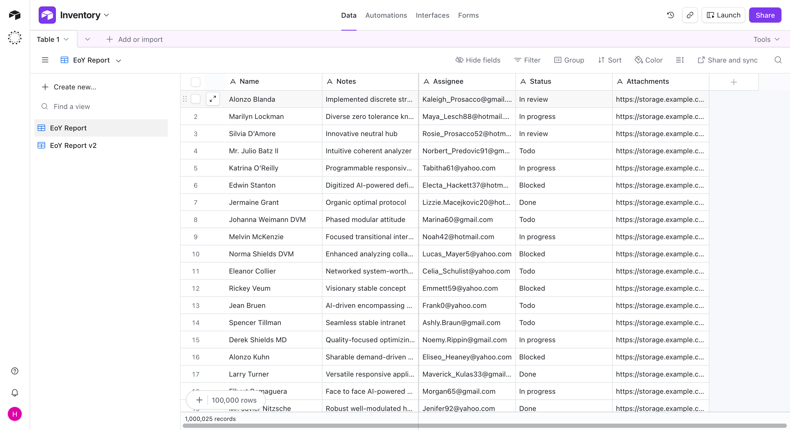
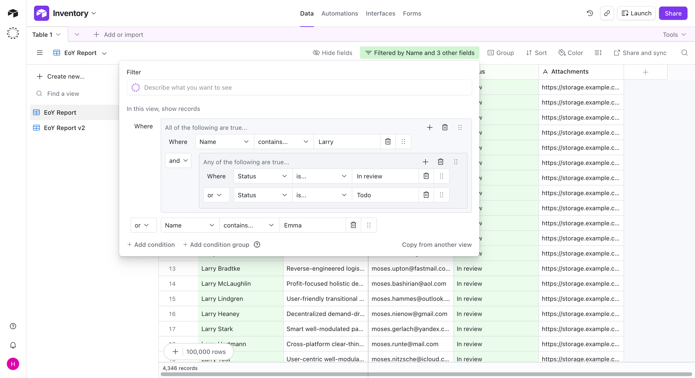
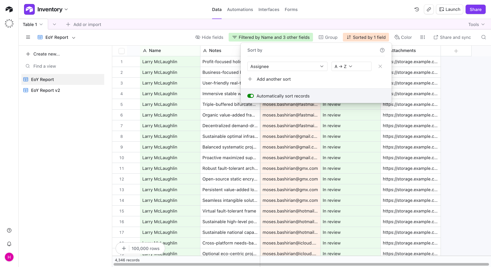
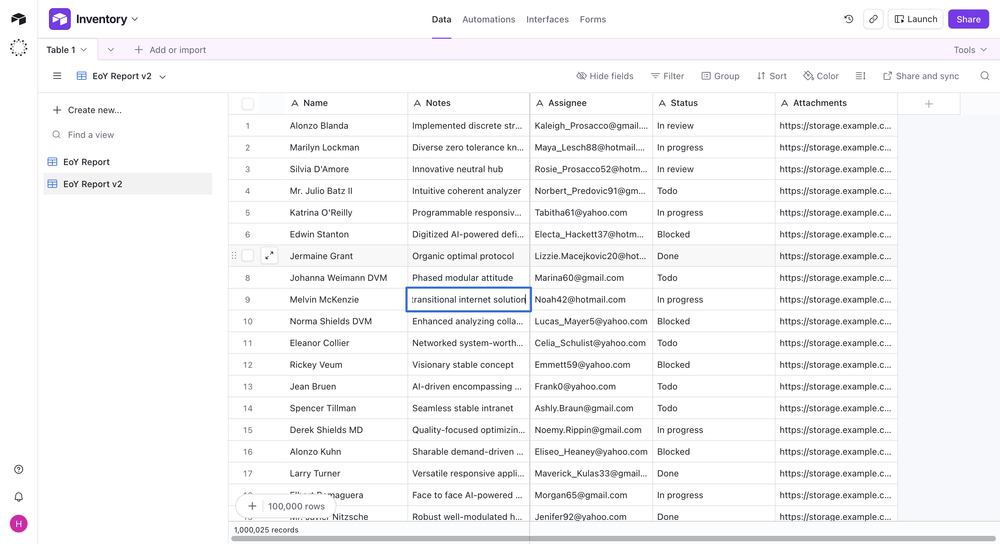

# Product screenshots

A visual tour of Airtable Engine running against a populated million-record table.

## Bases dashboard

Bases can be starred, and recently opened work stays immediately accessible from the dashboard.

## Grid at scale

The grid fetches and renders only the visible window while preserving direct access to all 1,000,025 records.

## Nested filters

Filter groups combine text and number conditions through nested AND/OR logic, with matching rows updated in place.

## Saved views and sorting

Each view retains its own configuration, while saved sorts are committed for rank-backed jumps through the result set.

## Search

Find-in-view highlights the active result, reports the full match count, and navigates to matches outside the loaded window.

## Cell editing

Keyboard-driven edits appear in the local grid immediately while the mutation completes in the background.
