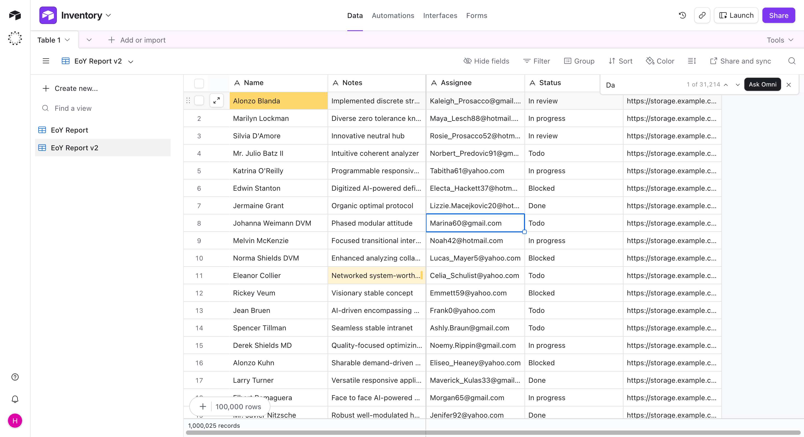
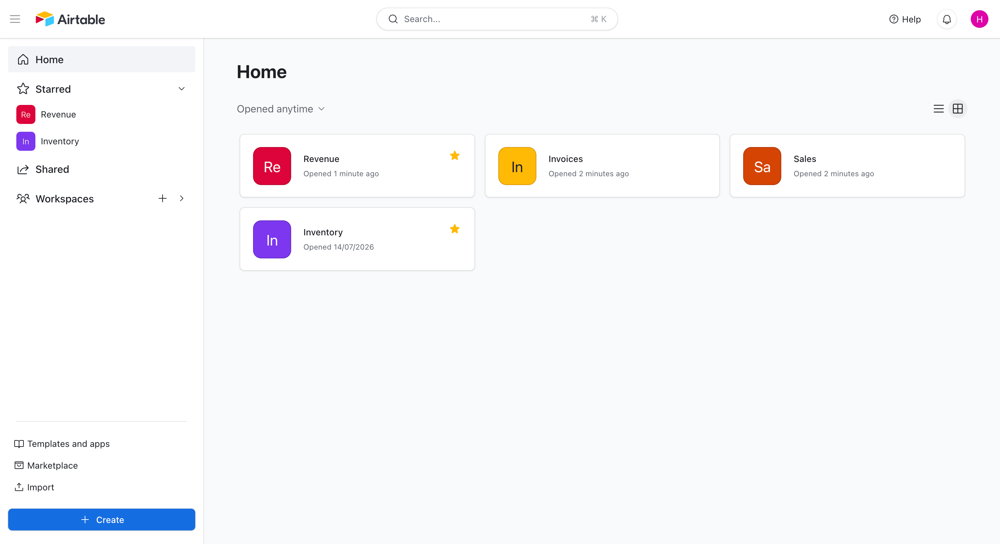

# Screenshots

A short tour of the main screens.

<!-- Screenshots are still to be captured. Run pnpm dev, use a window around 1440px wide, and save the files under docs/screenshots/ with the names below. -->

## Grid

A table with text and number fields, row controls, and the view toolbar.

## Million-row table

The table after using the bulk-add control.

## Scrollbar jump

A window loaded from deep in the table without fetching the rows above it.

## Cell editing

Keyboard editing with the local value shown before the mutation completes.

## Sort

A multi-field sort attached to the current view.

## Filter

Nested filter groups with AND/OR controls.

## Search

Find-in-view with previous and next match navigation.

## Saved views

Each view keeps its own search, filters, sort, field order, and hidden fields.

## Dashboard

The user's bases, with starred and recently opened items first.
